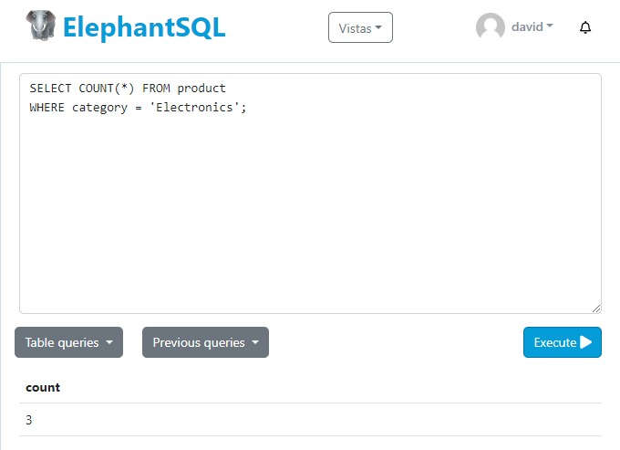
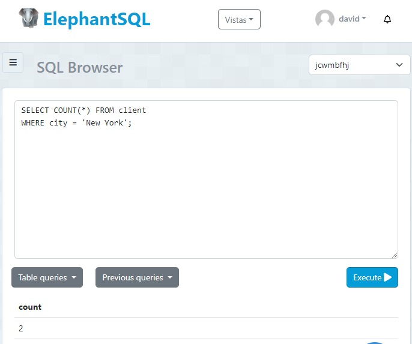
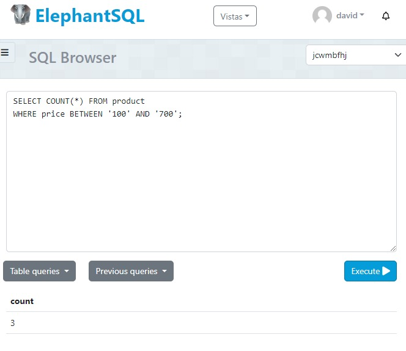
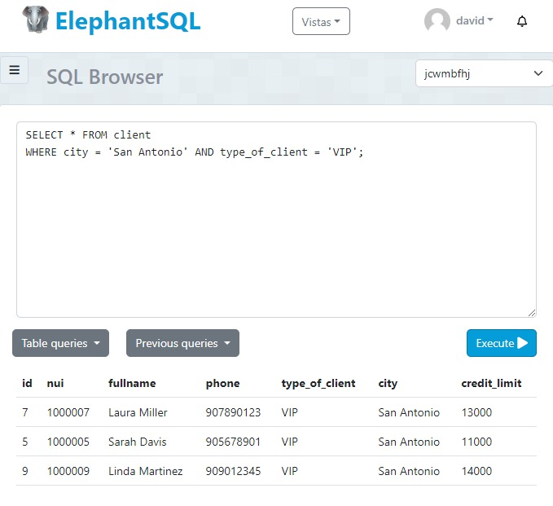
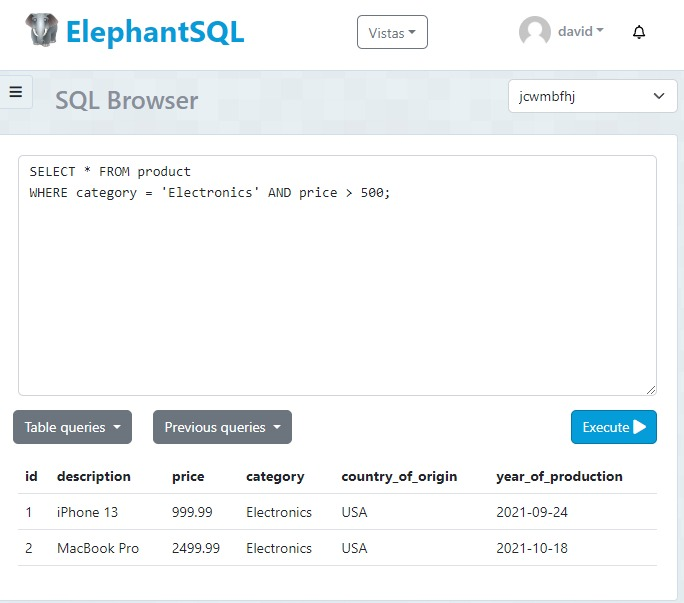
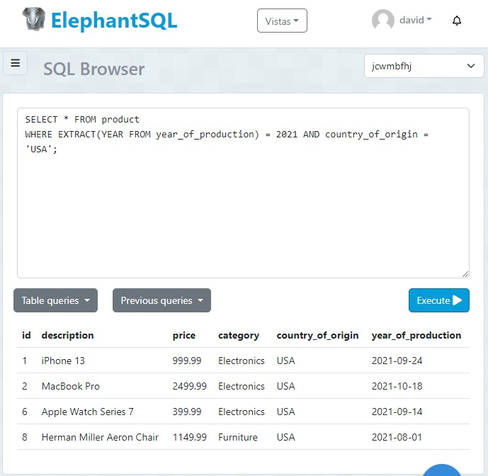
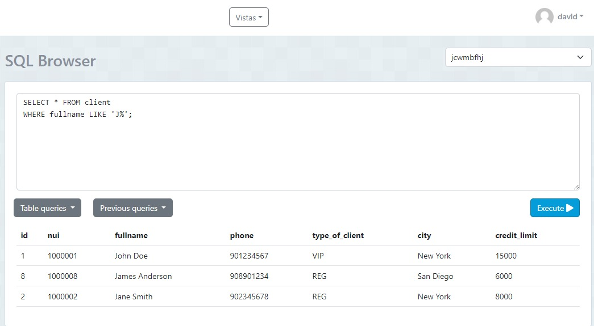
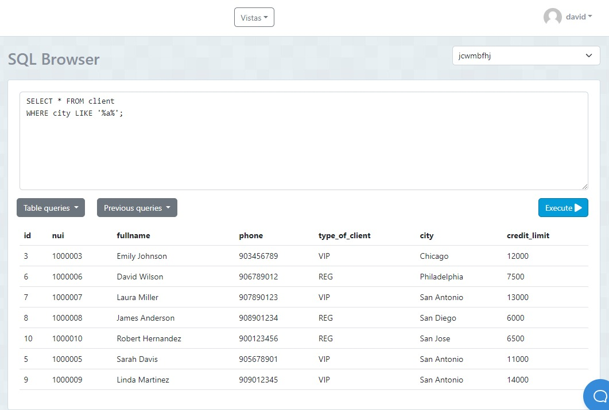

# Tarea TAS8 - Views

## 1. Contar el número de productos de una categoría específica

```sql
SELECT COUNT(*) FROM product
WHERE category = 'Electronics';
```



Esta consulta cuenta el número de productos en la tabla `product` donde la categoría (`category`) es 'Electronics'.

## 2. Contar el número de clientes en una ciudad específica

```sql
SELECT COUNT(*) FROM client
WHERE city = 'New York';
```



Esta consulta cuenta el número de clientes en la tabla `client` donde la ciudad (`city`) es 'New York'.

## 3. Contar el número de productos cuyo precio está dentro de un rango específico

```sql
SELECT COUNT(*) FROM product
WHERE price BETWEEN 100 AND 700;
```



Esta consulta cuenta el número de productos en la tabla `product` donde el precio (`price`) está entre 100 y 700.

## 4. Seleccionar clientes que viven en una ciudad específica y tienen un tipo de cliente específico

```sql
SELECT * FROM client
WHERE city = 'San Antonio' AND type_of_client = 'VIP';
```



Esta consulta selecciona todas las columnas de la tabla `client` donde la ciudad (`city`) es 'San Antonio' y el tipo de cliente (`type_of_client`) es 'VIP'.

## 5. Seleccionar productos que pertenecen a una categoría específica y cuyo precio está por encima de un valor específico

```sql
SELECT * FROM product
WHERE category = 'Electronics' AND price > 500;
```



Esta consulta selecciona todas las columnas de la tabla `product` donde la categoría (`category`) es 'Electronics' y el precio (`price`) es mayor a 500.

## 6. Seleccionar productos que fueron producidos en un año específico y en un país de origen específico

```sql
SELECT * FROM product
WHERE EXTRACT(YEAR FROM year_of_production) = 2021 AND country_of_origin = 'USA';
```



Esta consulta selecciona todas las columnas de la tabla `product` donde el año de producción (`year_of_production`) es 2021 y el país de origen (`country_of_origin`) es 'USA'.

## 7. Seleccionar clientes cuyo nombre completo comience con 'J'

```sql
SELECT * FROM client
WHERE fullname LIKE 'J%';
```



Esta consulta selecciona todas las columnas de la tabla `client` donde el nombre completo (`fullname`) comienza con la letra 'J'.

## 8. Seleccionar clientes cuya ciudad contenga la letra 'a'

```sql
SELECT * FROM client
WHERE city LIKE '%a%';
```



Esta consulta selecciona todas las columnas de la tabla `client` donde la ciudad (`city`) contiene la letra 'a'.
