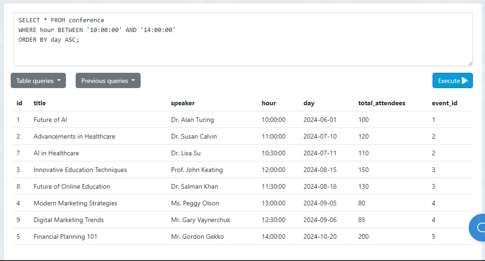

# Tarea TAS7 - Events

## 1. Listar por hora y día

```sql
SELECT * FROM conference
WHERE hour BETWEEN '10:00:00' AND '14:00:00'
ORDER BY day ASC;
```


Esta sentencia SQL selecciona todas las columnas de la tabla `conference` donde la hora (`hour`) está entre las 10:00 y las 14:00. Los resultados se ordenan de forma ascendente por la columna `day`.

## 2. Listar asistencia y registro de los miembros

```sql
SELECT * FROM register
WHERE assisted = true
ORDER BY registered_at ASC;
```


Esta consulta selecciona todas las columnas de la tabla `register` donde el valor de la columna `assisted` es `true`. Los resultados se ordenan de forma ascendente por la columna `registered_at`.

## 3. Listar eventos con 200 o más personas

```sql
SELECT * FROM event
WHERE total_attendees >= 200;
```


Esta consulta selecciona todas las columnas de la tabla `event` donde el número total de asistentes (`total_attendees`) es mayor o igual a 200.

## 4. Ordenar alfabeticamente el título de las conferencias

```sql
SELECT * FROM conference
ORDER BY title ASC;
```


Esta consulta selecciona todas las columnas de la tabla `conference` y ordena los resultados de forma ascendente según la columna `title`.

## 5. Listar eventos en San Francisco y fecha de manera ascendente

```sql
SELECT * FROM event
WHERE city = 'San Francisco'
ORDER BY start_date ASC;
```



Esta consulta selecciona todas las columnas de la tabla `event` donde la ciudad (`city`) es 'San Francisco'. Los resultados se ordenan de forma ascendente por la columna `start_date`.
